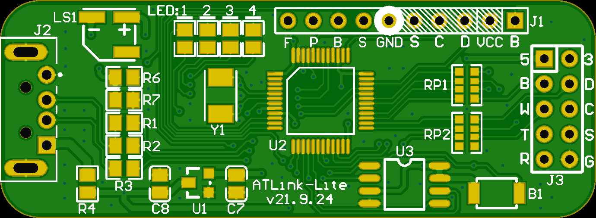
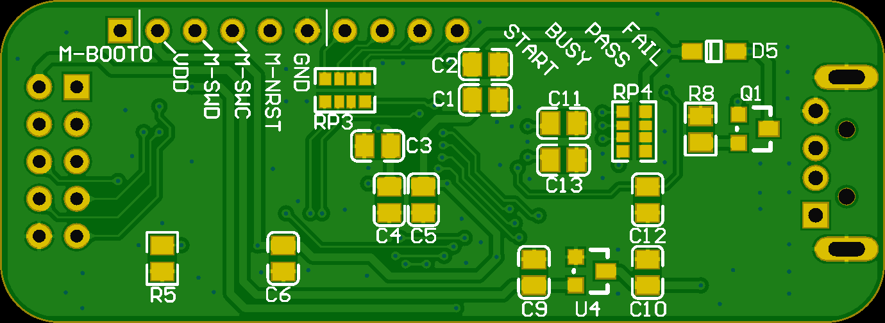

# ATLink-Lite用户手册

ATLink-Lite在雅特力官方AT-Like v1.4版本基础上对硬件做了一定精简，减少了器件种类和数量，
替换部分不容易购买的物料，同时固件保持完全兼容，方便普通用户DIY。

## 与官方AT-Link v1.4版本对比

- MCU引脚分配相同，固件完全通用
- 阻容二极管全部更换为0805封装，方便焊接，符合JLC的SMT标准
- RT9080N-08GJ5电源芯片更换为XC6206P332MR，更容易采购，保留双LDO设计
- 输出SWD端子更换为直插排针，减少整体长度，本身60mm已经很长了
- 8M无源5032晶振更换为2脚，更容易焊接
- 去掉4个2mm定位孔，PCB增加圆角，方便套热缩管
- 去掉USBLC6-2SC6等ESD器件，现代MCU的抗静电能力已经很强，低价值设备也没必要保护
- USB接口的防倒灌二极管更换为500mA自恢复保险丝
- 按键更换为3*4*2.5小龟仔

## 外观

## 资源汇总

- 可直接打样的[Gerber文件](HW/ATLink_v21.9.24_Gerber.zip)
- 参考[原理图](HW/ATLink_v21.9.24.pdf)
- 参考[BOM](HW/ATLink_v21.9.24_BOM.xlsx)
- ATLink官方v1.4版本[雅特力官方仓库](https://github.com/Artery-MCU/Artery-AT32-MCU-Pack/tree/main/Tool)
