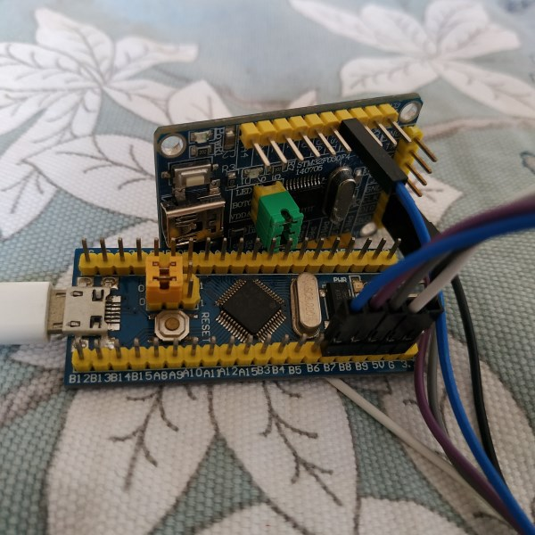
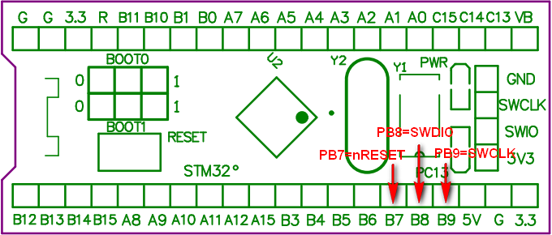
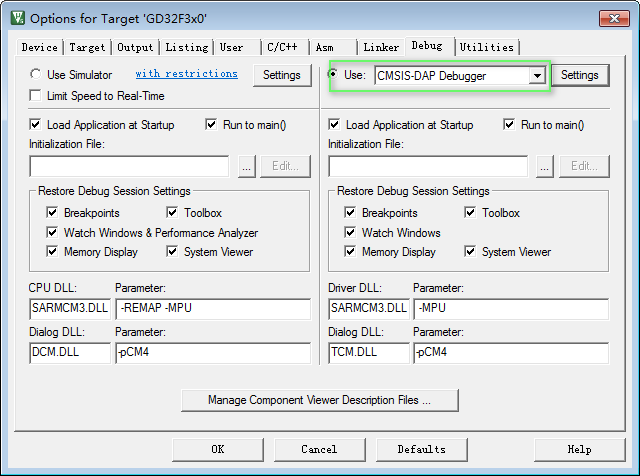
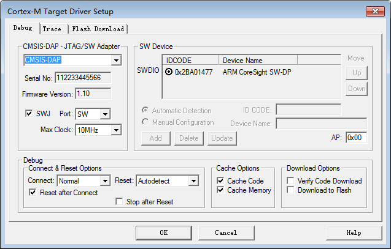

# CMSIS-DAP user manual

## Overview

CMSIS-DAP provides a standardized way to access the Coresight Debug Access Port (DAP) 
of an ARM Cortex M0 M0+ M3 M4 MCU via USB. It provides direct USB connection from 
a development board to a debugger running on a host computer on one side, and over 
JTAG or SWD to the target device to access the Coresight DAP on the other.
Click [CMSIS-DAP](https://os.mbed.com/handbook/CMSIS-DAP) to get more information.

This project is an ARM CMSIS-DAP debugger firmware porting on STM32 device. I 
purchased a minimal system board from taobao.com, cost me about 17 CNY(less than 3$).
With this firmware and board, I can debug Cortex M series MCUs from other verdors
such as GigaDevice NXP etc. For STM32, maybe ST-Link is a better choice.

For simplicity, I removed rarely used JTAG-Debug, Mass storage, Virtual COM features,
kept only the SWD-Debug feature. This leads to smaller code size and gets rid of
the trouble of install drivers on Windows.

The SYSCLK of STM32F103C8 is 48M and the code size about 12kB, so the minimal 
requirement is STM32F102C4.

## Usage

First of all, Flash your STM32F103C8 development board with CMSIS-DAP firmware, then your 
development board becomes a CMSIS-DAP Debugger.

Connect `SWCLK, SWDIO, nRESET, GND` to your target board, VCC(5V/3.3V) is optional.
You can power your target board with CMSIS-DAP.

| Port | Function   | Note             |
|:----:|:----------:|:----------------:|
| PB9  | SWCLK      |                  |
| PB8  | SWDIO      |                  |
| PB7  | nRESET     | to MCU NRST PIN  |

Press `Alt+F7`, click the `Debug` Tab, select `CMSIS-DAP Debugger`, and click `Settings` button.

Check CMSIS-DAP parameters.

Now you can **Erase Download Debug** your target board.
